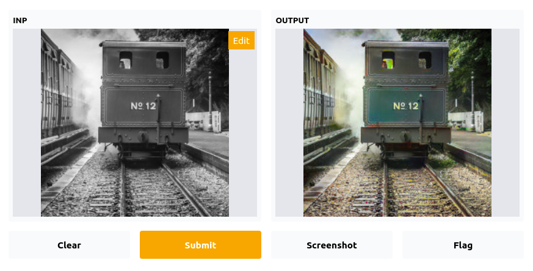
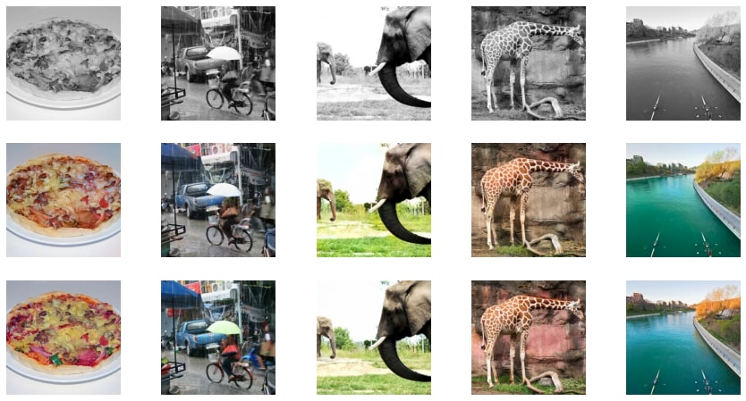

# Black and White Image color Restorer using a Generative Adversarial Network

## Introduction
Colorizing black and white pictures is one of the most intriguing uses of deep learning. Before the advent of GANs, researchers used vanilla neural networks to do this job, but the results were neither realistic nor convincing. In 2014, Ian Goodfellow came up with the notion of having two neural networks (Generator and Discriminator) fight against each other, similar to how the minimax algorithm works. This gave neural networks ability to generate photo-realistic images.

# Generator and Discriminator

The Generator model learns to create a realistic image from input noise, and the Discriminator model learns to differentiate between fake and real images. The generator's purpose is to deceive the discriminator by providing an image that looks identical to the reals. The discriminator's purpose is to estimate how realistic the generated image is. Both real and generated (fake) images of the same class are shown to the discriminator to tell the difference between the two.

## Methodology

We have used U-Net as the generator of our GAN with a pre-trained ResNet-18 backbone. We also pre-trained the generator for 20 epochs in a supervised and predetermined way to avoid the problem of "the blind leading the blind". The Implemented discriminator model is just a classifier built by stacking the blocks of Convolution Layer, BatchNormalization, and LeakyReLU as an activation function to determine if the input image is real or false.

To train our model, we used the dataset from Kaggle that consisted of 10800 images We implemented our code on Google-Colab as it provides access to GPUs. The model was trained for 30 epochs with a batch size of 16 to parallelize the data loading. The interface for the application is created using gradio module in python

### Results

The first row represents input black and white images. The second row represents generated colorized images by the trained generator in our GAN, while the third row represents the ground truth for generated images.

<table>
    <tr>
        <td>
            
        </td>
    </tr>
     
    <tr>
        <td>
            
        </td>
    </tr>
    <tr>
        <td>
            
        </td>
    </tr>
    <tr>
        <td>
            
        </td>
    </tr>
</table>

